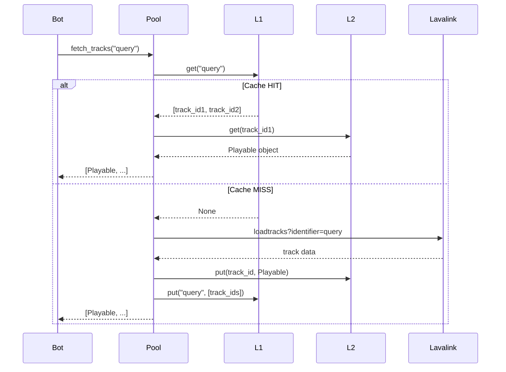

# HyperCache

HyperCache is Voltricx's built-in dual-tier caching system. It dramatically reduces redundant Lavalink API calls by caching search query results and individual track objects.

## Architecture

```
Pool.fetch_tracks("Never Gonna Give You Up")
        │
        ▼
┌────────────────────────────────────────────┐
│  L1: Query Cache (LRU)                     │
│  Maps query strings → list of track IDs   │
│  Capacity: configurable (default: 100)     │
└────────────────────┬───────────────────────┘
                     │ cache HIT → hydrate tracks from L2
                     │ cache MISS → fetch from Lavalink
                     ▼
┌────────────────────────────────────────────┐
│  L2: Track Registry (LFU with Decay)       │
│  Maps track ID (encoded) → Playable object │
│  Capacity: configurable (default: 1000)    │
└────────────────────────────────────────────┘
```

### L1 — Query Cache (LRU)

A **Least Recently Used** cache that maps raw query strings to lists of track IDs. When the same query is repeated, track objects are "hydrated" from L2 instantly — no Lavalink request needed.

### L2 — Track Registry (LFU with Decay)

A **Least Frequently Used** cache with **frequency decay**. Popular tracks stay cached longer; rarely accessed tracks are evicted first. The decay mechanism prevents old popular tracks from permanently occupying slots.

---

## Enabling HyperCache

Pass `cache_config` to `Pool.connect()`:

```python
await voltricx.Pool.connect(
    client=bot,
    nodes=[...],
    cache_config={
        "capacity": 100,          # Max L1 query entries
        "track_capacity": 1000,   # Max L2 track entries
        "decay_factor": 0.5,      # Frequency halved on decay pass
        "decay_threshold": 1000,  # Total hits before decay triggers
    },
)
```

Omitting `cache_config` (or passing `None`) **disables** caching entirely.

---

## Checking Cache Stats

```python
stats = voltricx.Pool.get_cache_stats()
print(f"L1 queries cached: {stats['l1_queries']}")
print(f"L2 tracks cached:  {stats['l2_tracks']}")
```

---

## Inspecting Cache Contents

```python
entries = voltricx.Pool.get_cache_entries()
for query, track_titles in entries.items():
    print(f"Query: {query!r}")
    for title in track_titles:
        print(f"  → {title}")
```

---

## Random Track from Cache

The AutoPlay engine uses this internally, but you can call it too:

```python
random_track = voltricx.Pool.get_random_cached_track()
if random_track:
    print(f"Random: {random_track.title}")
```

---

## Exporting Cache Data

Export the full state for debugging or persistence:

```python
data = voltricx.Pool.export_cache_data()
# Returns:
# {
#   "l1": { "query_string": ["encoded_id1", "encoded_id2"] },
#   "l2": { "encoded_id": "track_title" }
# }
```

---

## Using HyperCache Directly

You can instantiate `HyperCache` independently for custom use:

```python
from voltricx import HyperCache

cache = HyperCache(
    query_capacity=200,
    track_capacity=2000,
    decay_factor=0.5,
    decay_threshold=1000,
)

# Store results
cache.put_query("my query", [track1, track2])

# Retrieve
tracks = cache.get_query("my query")

# Resize dynamically
cache.resize(query_capacity=500, track_capacity=5000)
```

---

## Cache Performance Tips

| Tip | Explanation |
|-----|-------------|
| **Increase `track_capacity`** | For bots with many unique tracks — prevents L2 eviction |
| **Raise `decay_threshold`** | Reduces decay frequency → popular tracks stay longer |
| **Use `decay_factor` near 1.0** | Slower decay → old popular tracks harder to evict |
| **Set `default_search_source`** | Normalises queries so `"song"` and `"dzsearch:song"` cache together |

---

## Cache Flow Diagram


